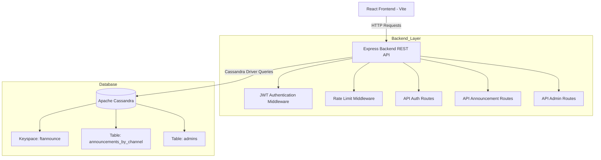

# FTAnnounce

## Background

In many university environments, important announcements are distributed through fragmented communication channels such as LINE groups, WhatsApp groups, email threads, and physical bulletin boards. As the number of announcements grows, students often struggle to revisit older information because announcements become buried beneath casual conversations and unrelated messages.

FTAnnounce was developed as a centralized announcement platform specifically designed for Fakultas Teknik Universitas Indonesia. The system organizes announcements into dedicated channels based on departments and categories, allowing students to efficiently browse chronological announcement histories while enabling administrators to publish structured and prioritized information.

The project adopts architectural concepts inspired by Discord's message storage model, but applies them to an academic information dissemination domain.

## Project Overview
FTAnnounce is a web application for managing and viewing announcements for **Fakultas Teknik**. The backend is an **Express REST API** that authenticates admin users using **JWT**, then stores and retrieves announcement data from **Apache Cassandra** (wide-column design). The frontend is a **React (Vite)** application that displays announcement feeds by channel and provides login + admin/profile features.

## Problem Statement

Current announcement distribution methods in university environments suffer from several major issues:

- Important academic information is scattered across multiple platforms.
- Students frequently miss announcements due to message flooding.
- There is no centralized archive for historical announcements.
- Information retrieval becomes inefficient over time.
- Cross-department announcements are difficult to discover.
- Existing messaging platforms are not optimized for structured academic communication.

FTAnnounce addresses these problems by providing:
- Channel-based announcement organization
- Chronological announcement feeds
- Priority-based announcement classification
- Centralized announcement history
- Secure admin authentication and publishing
- Scalable time-series data storage using Apache Cassandra

## Tech Stack
- **Frontend**: React (Vite)
- **Backend**: Node.js + Express
- **Database**: Apache Cassandra (wide-column store)
- **Auth**: JWT (`jsonwebtoken`) + password hashing (`bcryptjs`)
- **Security**: `helmet`, CORS, rate limiting (`express-rate-limit`)
- **Environment/Config**: `dotenv`

# User Interfaces


## Core Features

### Channel-Based Announcement Feed
Announcements are grouped into dedicated channels such as:
- Department channels
- Scholarship information
- Internship and career opportunities
- Academic events and seminars
- Student organizations

### Priority-Based Announcements
Each announcement can be categorized by urgency:
- `urgent`
- `important`
- `info`

This enables critical announcements to stand out from regular informational posts.

### JWT Authentication System
Authorized administrators authenticate using JWT-based login and protected API routes.

### Cassandra-Powered Time-Series Feed
Announcements are stored using a wide-column Cassandra schema optimized for:
- append-heavy workloads
- chronological retrieval
- partition-based scaling
- low-latency feed queries

### Pinned Announcement Logic
The backend supports temporary pinned announcements with channel-specific limits.

## Why Apache Cassandra?

FTAnnounce uses Apache Cassandra because the application follows a workload pattern similar to large-scale messaging platforms such as Discord.

The system primarily performs:
- frequent write operations
- chronological feed retrieval
- append-only announcement storage
- predictable query patterns

These characteristics align strongly with Cassandra's wide-column architecture.

### Why Wide-Column Store?

Wide-column databases are highly effective for time-series and feed-based systems because data can be partitioned and clustered according to query access patterns.

FTAnnounce uses:
- `channel_id` + `month_year_bucket` as the partition key
- `created_at` as the clustering key

This design enables:
- efficient retrieval of recent announcements
- chronological sorting without additional computation
- scalable partition growth
- avoidance of expensive JOIN operations

The schema follows Cassandra's query-driven design philosophy, where tables are designed based on application query requirements rather than relational normalization principles.

## System Architecture
## System Architecture


# Use Case Diagram


# System Flows


## Database Schema (Cassandra)
### Keyspace
- `ftannounce`
  - Replication: SimpleStrategy, replication_factor = 1

### Table: `announcements_by_channel`
Wide-column / append-only feed design.
```cql
CREATE TABLE IF NOT EXISTS announcements_by_channel (
  channel_id            TEXT,
  month_year_bucket     TEXT,
  created_at            TIMESTAMP,
  id                    UUID,
  author_name          TEXT,
  author_role          TEXT,
  author_account_type  TEXT,
  title                 TEXT,
  content               TEXT,
  priority              TEXT,
  attachment_url        LIST<TEXT>,
  pin_until             TIMESTAMP,
  PRIMARY KEY ((channel_id, month_year_bucket), created_at, id)
) WITH CLUSTERING ORDER BY (created_at DESC);
```

### Table: `admins`
Stores login credentials + profile data.
```cql
CREATE TABLE IF NOT EXISTS admins (
  username         TEXT PRIMARY KEY,
  password_hash    TEXT,
  display_name     TEXT,
  account_type     TEXT,
  role_title       TEXT,
  profile_picture  TEXT
);
```

## Query-Driven Data Modeling

Unlike relational databases, Cassandra tables are designed around query patterns rather than entity relationships.

FTAnnounce primarily serves the following query:

```cql
SELECT * FROM announcements_by_channel
WHERE channel_id = ?
AND month_year_bucket = ?
LIMIT 20;
```

Because this query is highly predictable and repeatedly executed, the schema is optimized specifically for:
- latest announcement retrieval
- chronological ordering
- pagination using timestamps
- append-heavy writes

This eliminates the need for JOIN operations and minimizes query overhead.

## API Endpoints
### Root / Health
- `GET /api/health`
  - Returns service status and timestamp.
- `GET /`
  - Returns basic information and endpoint list.

### Authentication
- `POST /api/auth/login`
  - Rate limited by `loginLimiter`
  - Request body: 
    - `username`: string
    - `password`: string
  - Response:
    - `token` (JWT)
    - `user` profile object

### Announcements
- `GET /api/announcements/:channel`
  - Rate limited by `readLimiter`
  - Query params:
    - `last_timestamp` (optional) for pagination (loads older announcements)
  - Response:
    - `channel`, `count`, `announcements[]`, `nextTimestamp`

- `POST /api/announcements`
  - Protected by `authenticate` (JWT)
  - Rate limited by `writeLimiter`
  - Request body:
    - `channelId`
    - `title`
    - `content`
    - `priority` (optional; defaults to `info`)
    - `attachments` (array or single value; max stored 3)
    - `pinDuration` (optional; supports limited durations)
  - Behavior:
    - Validates `channelId` against whitelist.
    - Fetches author profile from Cassandra (`admins`).
    - Enforces max **2 active pinned** announcements per channel.
    - Inserts announcement into `announcements_by_channel`.

### Admin/Profile
- `PUT /api/admin/profile`
  - Protected by `authenticate` (JWT)
  - Rate limiting not applied here (only global route protection)
  - Request body:
    - `displayName` (optional)
    - `roleTitle` (optional)
    - `profilePicture` (optional)
  - Rules:
    - `accountType === 'organization'` is forbidden to edit profile.

## Security Features

The backend includes several security protections:

- JWT authentication middleware
- Password hashing using bcrypt
- Rate limiting for login/read/write operations
- HTTP security headers using Helmet
- CORS protection
- Protected admin-only routes

These mechanisms help prevent unauthorized access, brute-force attacks, and API abuse.

## How to Run
> Assumes Docker Desktop is installed/running for Cassandra.

### 1) Start Cassandra (Docker)
```bash
docker-compose up -d
```

### 2) Backend
```bash
cd backend
npm install
npm run dev
```
Backend runs on `http://localhost:3001` by default.

### 3) (Optional) Seed Data
From `backend/`:
```bash
node seed.js
```

### 4) Frontend
```bash
cd frontend
npm install
npm run dev
```
Frontend runs on `http://localhost:5173` by default.

## Project Structure
```text
FTAnnounce/
├─ docker-compose.yml
├─ backend/
│  ├─ server.js
│  ├─ cassandra.js
│  ├─ seed.js
│  ├─ middleware/
│  │  ├─ auth.js
│  │  └─ rateLimit.js
│  ├─ routes/
│  │  ├─ auth.js
│  │  ├─ announcements.js
│  │  └─ admin.js
│  └─ package.json
└─ frontend/
   ├─ index.html
   ├─ vite.config.js
   ├─ src/
   │  ├─ main.jsx
   │  ├─ App.jsx
   │  ├─ api.js
   │  ├─ index.css
   │  ├─ assets/
   │  ├─ components/
   │  ├─ pages/
   │  └─ data/
   └─ package.json
```
