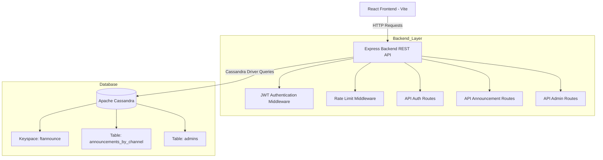

# FTAnnounce

## Latar Belakang

Di lingkungan universitas, pengumuman penting sering kali tersebar melalui berbagai kanal komunikasi yang terfragmentasi, seperti grup LINE, grup WhatsApp, utas surel, dan papan pengumuman fisik. Seiring bertambahnya jumlah pengumuman, mahasiswa kerap kesulitan untuk menemukan kembali informasi lama karena pengumuman sudah tertimbun oleh percakapan santai dan pesan-pesan yang tidak relevan.

FTAnnounce dikembangkan sebagai platform pengumuman terpusat yang dirancang khusus untuk Fakultas Teknik Universitas Indonesia. Sistem ini mengelompokkan pengumuman ke dalam kanal-kanal berdasarkan departemen dan kategori, sehingga mahasiswa dapat menelusuri riwayat pengumuman secara kronologis dengan efisien, sementara administrator dapat menerbitkan informasi yang terstruktur dan terprioritaskan.

Proyek ini mengadopsi konsep arsitektural yang terinspirasi dari model penyimpanan pesan Discord, tetapi diterapkan pada ranah diseminasi informasi akademik.

## Ikhtisar Proyek

FTAnnounce adalah aplikasi web untuk mengelola dan menampilkan pengumuman bagi **Fakultas Teknik**. Backend dibangun menggunakan **Express REST API** yang mengautentikasi pengguna admin melalui **JWT**, kemudian menyimpan dan mengambil data pengumuman dari **Apache Cassandra** (desain wide-column). Frontend menggunakan **React (Vite)** yang menampilkan umpan pengumuman berdasarkan kanal serta menyediakan fitur masuk (login) dan fitur admin/profil.

## Rumusan Masalah

Metode distribusi pengumuman yang saat ini digunakan di lingkungan universitas memiliki beberapa permasalahan utama:

- Informasi akademik penting tersebar di berbagai platform.
- Mahasiswa sering melewatkan pengumuman akibat banjir pesan.
- Tidak ada arsip terpusat untuk riwayat pengumuman.
- Pencarian informasi menjadi tidak efisien seiring waktu.
- Pengumuman lintas departemen sulit ditemukan.
- Platform perpesanan yang ada tidak dioptimalkan untuk komunikasi akademik yang terstruktur.

FTAnnounce mengatasi permasalahan ini dengan menyediakan:

- Organisasi pengumuman berbasis kanal
- Umpan pengumuman kronologis
- Klasifikasi pengumuman berdasarkan prioritas
- Riwayat pengumuman terpusat
- Autentikasi admin yang aman beserta fitur penerbitan
- Penyimpanan data deret waktu yang skalabel menggunakan Apache Cassandra

## Tumpukan Teknologi

- **Frontend**: React (Vite)
- **Backend**: Node.js + Express
- **Basis Data**: Apache Cassandra (wide-column store)
- **Autentikasi**: JWT (`jsonwebtoken`) + hashing kata sandi (`bcryptjs`)
- **Keamanan**: `helmet`, CORS, pembatasan laju (`express-rate-limit`)
- **Konfigurasi Lingkungan**: `dotenv`

## Antarmuka Pengguna


## Fitur Inti

### Umpan Pengumuman Berbasis Kanal

Pengumuman dikelompokkan ke dalam kanal-kanal khusus seperti:

- Kanal departemen
- Informasi beasiswa
- Peluang magang dan karier
- Acara akademik dan seminar
- Organisasi kemahasiswaan

### Pengumuman Berbasis Prioritas

Setiap pengumuman dapat dikategorikan berdasarkan tingkat urgensi:

- `urgent` (mendesak)
- `important` (penting)
- `info` (informasi)

Hal ini memungkinkan pengumuman kritis untuk lebih menonjol dibandingkan kiriman informasi biasa.

### Sistem Autentikasi JWT

Administrator yang berwenang melakukan autentikasi menggunakan login berbasis JWT dan rute API yang dilindungi.

### Umpan Deret Waktu Berbasis Cassandra

Pengumuman disimpan menggunakan skema Cassandra wide-column yang dioptimalkan untuk:

- Beban kerja yang dominan operasi tulis (append-heavy)
- Pengambilan data secara kronologis
- Penyimpanan pengumuman secara append-only
- Kueri umpan dengan latensi rendah

### Logika Pengumuman Tersemat (Pinned)

Backend mendukung pengumuman tersemat sementara dengan batas per kanal.

## Mengapa Apache Cassandra?

FTAnnounce menggunakan Apache Cassandra karena aplikasi ini mengikuti pola beban kerja yang serupa dengan platform perpesanan berskala besar seperti Discord.

Sistem ini utamanya melakukan:

- Operasi tulis yang sering
- Pengambilan umpan secara kronologis
- Penyimpanan pengumuman secara append-only
- Pola kueri yang dapat diprediksi

Karakteristik ini sangat selaras dengan arsitektur wide-column milik Cassandra.

### Mengapa Wide-Column Store?

Basis data wide-column sangat efektif untuk sistem berbasis deret waktu dan umpan karena data dapat dipartisi dan dikelompokkan sesuai pola akses kueri.

FTAnnounce menggunakan:

- `channel_id` + `month_year_bucket` sebagai kunci partisi
- `created_at` sebagai kunci klaster

Desain ini memungkinkan:

- Pengambilan pengumuman terbaru secara efisien
- Pengurutan kronologis tanpa komputasi tambahan
- Pertumbuhan partisi yang skalabel
- Penghindaran operasi JOIN yang mahal

Skema ini mengikuti filosofi desain berbasis kueri (query-driven) milik Cassandra, di mana tabel dirancang berdasarkan kebutuhan kueri aplikasi, bukan berdasarkan prinsip normalisasi relasional.

## Arsitektur Sistem




## Diagram Kasus Penggunaan


## Alur Sistem


## Skema Basis Data (Cassandra)

### Keyspace

- `ftannounce`
  - Replikasi: SimpleStrategy, replication_factor = 1

### Tabel: `announcements_by_channel`

Desain wide-column / umpan append-only.

```cql
CREATE TABLE IF NOT EXISTS announcements_by_channel (
  channel_id            TEXT,
  month_year_bucket     TEXT,
  created_at            TIMESTAMP,
  id                    UUID,
  author_name          TEXT,
  author_role          TEXT,
  author_account_type  TEXT,
  title                 TEXT,
  content               TEXT,
  priority              TEXT,
  attachment_url        LIST<TEXT>,
  pin_until             TIMESTAMP,
  PRIMARY KEY ((channel_id, month_year_bucket), created_at, id)
) WITH CLUSTERING ORDER BY (created_at DESC);
```

### Tabel: `admins`

Menyimpan kredensial login dan data profil.

```cql
CREATE TABLE IF NOT EXISTS admins (
  username         TEXT PRIMARY KEY,
  password_hash    TEXT,
  display_name     TEXT,
  account_type     TEXT,
  role_title       TEXT,
  profile_picture  TEXT
);
```

## Pemodelan Data Berbasis Kueri

Berbeda dengan basis data relasional, tabel Cassandra dirancang berdasarkan pola kueri, bukan berdasarkan relasi entitas.

FTAnnounce utamanya melayani kueri berikut:

```cql
SELECT * FROM announcements_by_channel
WHERE channel_id = ?
AND month_year_bucket = ?
LIMIT 20;
```

Karena kueri ini sangat dapat diprediksi dan dieksekusi secara berulang, skema dioptimalkan secara khusus untuk:

- Pengambilan pengumuman terbaru
- Pengurutan kronologis
- Paginasi menggunakan stempel waktu
- Operasi tulis yang dominan (append-heavy)

Hal ini menghilangkan kebutuhan akan operasi JOIN dan meminimalkan beban kueri.

## Endpoint API

### Root / Kesehatan

- `GET /api/health`
  - Mengembalikan status layanan dan stempel waktu.
- `GET /`
  - Mengembalikan informasi dasar dan daftar endpoint.

### Autentikasi

- `POST /api/auth/login`
  - Dibatasi oleh `loginLimiter`
  - Badan permintaan:
    - `username`: string
    - `password`: string
  - Respons:
    - `token` (JWT)
    - Objek profil `user`

### Pengumuman

- `GET /api/announcements/:channel`
  - Dibatasi oleh `readLimiter`
  - Parameter kueri:
    - `last_timestamp` (opsional) untuk paginasi (memuat pengumuman lebih lama)
  - Respons:
    - `channel`, `count`, `announcements[]`, `nextTimestamp`

- `POST /api/announcements`
  - Dilindungi oleh `authenticate` (JWT)
  - Dibatasi oleh `writeLimiter`
  - Badan permintaan:
    - `channelId`
    - `title`
    - `content`
    - `priority` (opsional; bawaan `info`)
    - `attachments` (larik atau nilai tunggal; maksimal 3 disimpan)
    - `pinDuration` (opsional; mendukung durasi terbatas)
  - Perilaku:
    - Memvalidasi `channelId` terhadap daftar putih.
    - Mengambil profil penulis dari Cassandra (`admins`).
    - Memberlakukan maksimal **2 pengumuman tersemat aktif** per kanal.
    - Menyisipkan pengumuman ke `announcements_by_channel`.

### Admin/Profil

- `PUT /api/admin/profile`
  - Dilindungi oleh `authenticate` (JWT)
  - Pembatasan laju tidak diterapkan di sini (hanya perlindungan rute global)
  - Badan permintaan:
    - `displayName` (opsional)
    - `roleTitle` (opsional)
    - `profilePicture` (opsional)
  - Aturan:
    - `accountType === 'organization'` dilarang mengedit profil.

## Fitur Keamanan

Backend mencakup beberapa perlindungan keamanan:

- Middleware autentikasi JWT
- Hashing kata sandi menggunakan bcrypt
- Pembatasan laju untuk operasi login/baca/tulis
- Header keamanan HTTP menggunakan Helmet
- Perlindungan CORS
- Rute khusus admin yang dilindungi

Mekanisme ini membantu mencegah akses tidak sah, serangan brute-force, dan penyalahgunaan API.

## Cara Menjalankan

> Pastikan Docker Desktop sudah terpasang dan berjalan untuk Cassandra.

### 1) Jalankan Cassandra (Docker)

```bash
docker-compose up -d
```

### 2) Backend

```bash
cd backend
npm install
npm run dev
```

Backend berjalan di `http://localhost:3001` secara bawaan.

### 3) (Opsional) Data Awal (Seed)

Dari direktori `backend/`:

```bash
node seed.js
```

### 4) Frontend

```bash
cd frontend
npm install
npm run dev
```

Frontend berjalan di `http://localhost:5173` secara bawaan.

## Struktur Proyek

```text
FTAnnounce/
├─ docker-compose.yml
├─ backend/
│  ├─ server.js
│  ├─ cassandra.js
│  ├─ seed.js
│  ├─ middleware/
│  │  ├─ auth.js
│  │  └─ rateLimit.js
│  ├─ routes/
│  │  ├─ auth.js
│  │  ├─ announcements.js
│  │  └─ admin.js
│  └─ package.json
└─ frontend/
   ├─ index.html
   ├─ vite.config.js
   ├─ src/
   │  ├─ main.jsx
   │  ├─ App.jsx
   │  ├─ api.js
   │  ├─ index.css
   │  ├─ assets/
   │  ├─ components/
   │  ├─ pages/
   │  └─ data/
   └─ package.json
```
